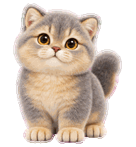

# 卡布 🐾

一只圆脸、温柔好奇的蓝金渐层小猫咪，拥有蓝灰色毛尖、奶金色底毛和蜜糖色眼睛。

- 9 组常规动作：待机、向右跑、向左跑、挥爪、小跳跃、委屈、等待、忙碌、查看结果。
- 16 个张望方向。
- Codex v2 宠物格式，透明 WebP 图集，尺寸为 1536 × 2288。

## 文件

- `pet.json`：宠物配置，显示名称为「卡布」。
- `spritesheet.webp`：完整动画图集。
- `preview.gif`：待机预览。

`pet.json` 与 `spritesheet.webp` 应保存在同一目录。内部 ID 保留为 `lantang`，与原宠物保持一致。

图像使用 OpenAI 内置 imagegen 生成，已完成图集、透明边缘和视线方向检查。
